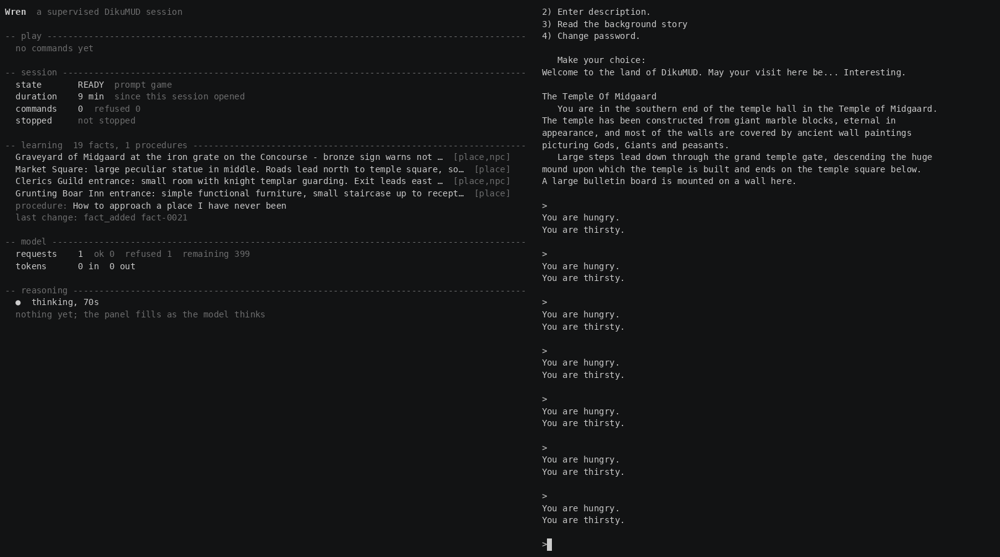

# DikuMUD Hermes Agent Player

A persistent AI agent that plays the original 1991 DikuMUD, one command at a
time, through a purpose-built MCP boundary.



Five moments from one 100-turn session. The left panels carry the commands with
the intent the model stated before sending each one, the session and model
state, and the model's reasoning as it arrives; the game's own output scrolls on
the right. Over the clip the learning store goes from 19 facts to 23 and the
relay's fallback counter from 8 to 10, the first model in the order having
become too slow to answer. The full session is in
[`public-documentation/DEMO.md`](public-documentation/DEMO.md).

The agent is a [Hermes](https://hermes-agent.nousresearch.com/) profile running
NVIDIA Nemotron 3 Ultra through OpenRouter. It reaches the game only through five
MCP tools that own a TinTin++ session in another container. It has no browser, no
shell, no filesystem, no general network access, and no route to the game server,
the game's source, or its world files.

This is not an optimised MUD bot. The AI playing the MUD is the project.

## What it demonstrates

- Calling an external model through a fixed-policy local relay that cannot be
  used as a general proxy.
- A custom MCP server in Python 3.12 driving a legacy Telnet application through
  a PTY, with an enforced one-command-per-turn protocol.
- An agent constrained to a narrow tool surface by construction, with the enabled
  surface recorded and tested.
- Factual and procedural learning that survives restarts, is schema-validated on
  write **and on load**, and cannot become executable content.
- A least-privilege container deployment whose network graph is checked from
  inside the containers.

## Quick start

Needs Docker with Compose v2, and about 3 GB of disk for the agent image.

```bash
cp .env.example .env          # then edit SECRETS_DIR and MUD_CHARACTER
$EDITOR .env

mkdir -p -m 700 ~/.config/dikumud-hermes
printf '%s\n%s\n' 'Wren' 'your-password' > ~/.config/dikumud-hermes/game-credential
printf '%s\n' 'sk-or-v1-...' > ~/.config/dikumud-hermes/openrouter.key
chmod 644 ~/.config/dikumud-hermes/*      # see .env.example for why 644
```

Then three scripts, in order:

```bash
scripts/1.start-stack     # checks the secrets and the model config, applies the
                          # SEC-07 host firewall rules (sudo), starts the four
                          # services health-gated, then runs the boundary checks
scripts/2.start-agent     # plays one supervised session, watches it, and leaves
                          # a capture in sessions/
scripts/3.stop-stack      # closes the game session, then stops the services
```

Two more for choosing who plays:

```bash
scripts/4.load-character Wren    # play as an existing character
scripts/5.new-character Bram     # make a new one and load it
```

And one for which model leads:

```bash
scripts/set-model-order                  # pick which model leads, from a menu
scripts/set-model-order --list           # the configured models, in order
scripts/set-model-order lightning ultra  # or name an exact order
```

`2.start-agent` never chooses a character; it resumes whichever one is loaded and
says which before it starts. Two separate values decide who plays: the login name
in the credential file, and `MUD_CONTROL_CHARACTER`, which keys the learning
store. Nothing in the service reconciles them, so `4.load-character` and
`5.new-character` write both from one input.

`1.start-stack` applies the egress rules **before** starting the stack, which is
the order that survives a reboot: the relay self-tests for those rules and
refuses to start without them. `public-documentation/OPERATIONS.md` section 0 has
the same sequence by hand, and what to do when a step fails closed.

Those rules are host firewall state and do not survive a reboot on their own.
Installing the unit applies them at boot:

```bash
sudo scripts/install-egress-unit    # applies them at boot, and after a Docker
                                    # daemon restart; 1.start-stack then stops
                                    # asking for sudo
```

Nothing runs unattended: the agent container idles until `2.start-agent` starts a
session, and Ctrl-C in its spectator ends that run. The character and its
learning persist, so the next run resumes where the last one stopped. Each run
leaves its own record behind: the game's own output, the transcript, the final
frame and a GIF of the spectator, in a directory under `sessions/` that is not
committed. `public-documentation/OPERATIONS.md` section 8.1 lists what is in one.

## How it fits together

```
hermes-player ──MCP──> mud-control ──Telnet──> dikumud
      │                    │
      │                    └── TinTin++ in a PTY, the game credential,
      │                        the audit record, the learning store
      └──OpenAI API──> openrouter-relay ──HTTPS──> OpenRouter
```

Four services, four networks, one authorised flow each. `hermes-player` cannot
resolve `dikumud`. `mud-control` has no route off the host. Only the relay has
egress, and only to one destination. No port is published.

| Document | What it holds |
| --- | --- |
| `public-documentation/DESIGN.md` | The architecture, the boundaries, and why each is drawn where it is |
| `SECURITY.md` | Threat model and mandatory controls |
| `public-documentation/DEMO.md` | The recorded demonstration, what it shows, and what is deliberately absent |
| `public-documentation/OPERATIONS.md` | Running it, and what to do when something fails closed |
| `public-documentation/REPRODUCE.md` | Clean-room reproduction from an empty machine |
| `public-documentation/TEST_PLAN.md` | The test matrix, by identifier |
| `public-documentation/DEPENDENCY_RECORD.md` | Every upstream revision, image digest and model pin, and why |

## What is verified

| Area | Evidence |
| --- | --- |
| Tests | 341 mud-control, 166 relay, from the images the deployment runs |
| Security | `SEC-01` to `SEC-10`, run against the deployed stack |
| Boundary | 21 network checks from inside the containers, `scripts/verify-network-boundaries` |
| Behaviour | `E2E-01` to `E2E-05` |

The test identifiers are defined in `public-documentation/TEST_PLAN.md`. Both
suites build their test image from the runtime image, so what is tested is the
code the deployment runs:

```bash
docker build -f services/mud-control/Dockerfile.test -t mud-control:test services/mud-control
docker run --rm -v "$PWD/tests:/tests:ro" mud-control:test

docker build -f services/openrouter-relay/Dockerfile.test -t openrouter-relay:test services/openrouter-relay
docker run --rm openrouter-relay:test
```

`scripts/verify-network-boundaries` opens connections from inside each container
to every peer it should and should not be able to reach, and exits non-zero on
any surprise. It takes about a minute and needs no root.

## The knowledge boundary

The defensible claim is that **the agent receives no external game information**.
It has no web access, no strategy guides, no world files, no database access and
no prebuilt maps, and it must ask the game's own `help` like any other player.

The claim is *not* that the model has no prior knowledge of DikuMUD. Nemotron was
trained on the public internet, DikuMUD is thirty-five years old, and that cannot
be removed or conclusively measured. In one observed session the agent referred
to the market square as "the center of Midgaard" before it had been there, which
is the kind of thing this limitation predicts. What the project demonstrates is
the external-retrieval boundary.

## Limitations

- **Supervised, not autonomous.** Sessions are started by an operator and bounded
  by turns, wall-clock, repetition, refusals and relay budgets. Every session
  ends with a recorded stop reason.
- **The free model endpoint is not an availability commitment.** Sessions in
  development were ended by upstream 502s and quota more than once. The relay
  answers this with bounded retries down an ordered set of verified models, one
  attempt each, and fails closed with an explicit reason once the order is
  exhausted. It never reaches a model outside that set, and the caller cannot
  choose among them. Which models, and in what order, is the operator's to set in
  `config/relay/models.toml` before the relay starts, through
  `scripts/set-model-order`. The shipped set is Nemotron 3 Ultra, then Super,
  then 3.5 Lightning.
- **The egress restriction is host state.** It survives `compose down`/`up` but
  not a reboot on its own. The relay refuses to start without it, so the gap
  cannot go unnoticed, but persisting it is the operator's job.
- **Docker isolation is not a separate physical host**, and stock DikuMUD is a
  1991 C program. It runs non-root, read-only, capability-dropped, with no route
  out and no reachable peers.

## Licensing

This project's own code is Copyright (C) 2026 Cody Nicholson and is licensed
under the GNU Lesser General Public License, version 2.1 only. The full text is
in `LICENSE`. That covers everything in this repository that is not third-party
material, whether or not an individual file carries a notice of its own.

DikuMUD is used under its original licence, TinTin++ is GPL-3.0-or-later, and
both upstream notices are preserved in the images and recorded in
`THIRD_PARTY_NOTICES.md` along with the exact pinned revisions. Local
compatibility patches to DikuMUD are kept as separate documented patch files in
`services/dikumud/patches/`.
