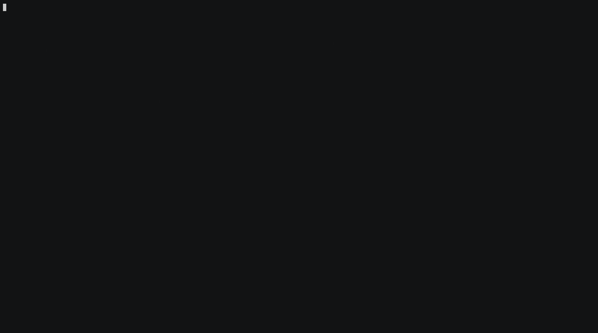

# The demonstration

What to run, what you will see, and what is deliberately absent from it.

## Running it

One command, which plays a session and watches it:

```bash
scripts/2.start-agent --turns 22
```

It resumes whichever character the stack is loaded with, records the spectator
while the session runs, and leaves a capture in `sessions/` when it ends.
`scripts/4.load-character <Name>` changes who plays first.

The two halves separately, which is what that script does:

```bash
docker compose exec hermes-player hermes chat --max-turns 22 \
  -q "Read your notes with learn_recall, then connect and continue exploring
      where your notes stop. Before you stop, store anything worth remembering."
```

```bash
scripts/spectate
```

The agent container idles until you do this. There is no autonomous loop, which
is the design's own non-goal about unattended operation, and it means the demo is
exactly as long as you let it be.



`demo/spectate.gif` is a 100-turn supervised session, seventeen minutes,
unedited, and `demo/spectate.cast` is the asciicast it was made from. The cast
is the more useful of the two for a reviewer: it is text, it replays at any
speed with `asciinema play`, and it can be searched. `demo/spectator-frame.txt`
is the final frame and `demo/transcript.txt` is the same session read back from
the audit record.

`demo/highlights.gif` is the shorter clip on the README: five segments cut from
this same session and played at 2.5x, with `demo/highlights.cast` beside it.
Each segment begins on a full screen repaint, so nothing is spliced mid-frame.

## What the spectator shows

The spectator draws five panels on the left and, on a wide enough terminal, the
game's own output in a column to the right.

| Panel | Holds |
| --- | --- |
| play | One line per command: the time, the command sent, and the intent the model stated before sending it. The last refusal, if there was one |
| session | Transport and prompt state, how long this session has been open, commands accepted and refused, and the stop reason once it has one |
| learning | The facts and procedures this character has accumulated, with the most recent change |
| model | Requests made, accepted and refused, requests remaining in the budget, and tokens in and out |
| reasoning | The model's reasoning as it is produced, with an indicator that pulses while a call is open |

The game feed to the right carries room descriptions, combat and replies as they
arrive.

A session that ends says why: a turn budget spent, a quota, a repetition stop,
an unrecoverable disconnect and a transport fault each name themselves in the
session panel. `stopped not stopped`, as in the published frame, means the
session was still open when the frame was taken.

The published capture shows the fallback in use. Its model panel reads
`fell back 10x from the primary`, with a `max` latency of 119 seconds: the first
model in the order was answering too slowly, each attempt spent its wall-clock
deadline, and the next model served the turn. The panel names whichever model
answered.

## The transcript

A capture's `transcript.txt` is the same session read from the audit record:

```
15:34:52  session    opened game
15:35:37  mud_act    look board       | Checking the bulletin board for useful information
15:36:06  mud_act    north            | Moving north to the temple altar to explore
15:36:18  mud_act    exits            | Checking what exits are available from the temple altar
```

One line per command, each with the intent the model stated before sending it,
and one `mud_act` per command. `intent` is a required field with a minimum
length; an optional one is never filled in.

## What you will see, and what you will not

- **The model's reasoning, live.** The relay streams its upstream call and writes
  the reasoning deltas to a feed as they arrive, so the panel fills while the
  model is still working, not once it has answered.
- **No credentials.** The game password is redacted from observations before they
  are buffered and again when they are served; the API key is read from a file
  inside the relay and never leaves it. The reasoning feed cannot contain the
  game password either, and not by filtering: the relay never sees it, so it is
  not in the model's context and the model cannot think about it.
- **No raw environment or framework internals.** The spectator reads the audit
  record, the learning store, the play log, the relay's metrics endpoint and the
  relay's reasoning feed. None of those contain any.

Two boundaries sit beside the reasoning panel:

- **The audit record refuses a reasoning field by name**, so `transcript.txt`
  stays free of content and stays publishable without review. The reasoning feed
  is a view of a session; the audit record is evidence of one.
- **The agent does not receive its own reasoning back.** The relay strips it from
  every reply. What a watcher sees and what the player knows are different
  questions.

The feed is a file inside the relay container, not an HTTP endpoint.
`scripts/spectate` reads `/metrics` from inside `hermes-player`, so anything the
relay served over HTTP would be readable by the agent too.

## The recording

Every session records itself. `scripts/2.start-agent` writes a capture into
`sessions/` when the run ends: the game's own output, the transcript, the final
frame, the client's log, the reasoning feed, the cast, and the GIF.
`OPERATIONS.md` section 8.1 lists what each file is. Publishing one means copying
it into `demo/` beside this document, after the disclosure review below.

The two commands below are what that automation runs, kept here for the flags.
Recorded with asciinema 2.4.0 and converted with agg 1.9.0:

```bash
asciinema rec sessions/<run>/session.cast --overwrite \
  --idle-time-limit 2 -c "scripts/spectate --until-stopped"
agg --theme asciinema --font-size 14 --speed 1.5 \
  sessions/<run>/session.cast sessions/<run>/session.gif
```

**Watch in a terminal at least 143 columns wide**, or there is no game feed to
record. The spectator gives its panels 100 columns, a 3-column gap, and needs 40
left before a feed is too narrow to read a room description in; under that it
draws the panels alone. The recording inherits the terminal's size, so what you
watch and what the recording shows are the same. Forcing a pty narrower than the
feed needs suppresses the column however wide the real terminal is.

`--until-stopped` bounds the recording. A spectator killed by a signal leaves
asciinema without a clean end and freezes the GIF on whatever was on screen; the
bounded loop exits by itself once the session has ended, whether that was at the
boundary or from the client spending its turn budget.

**Review any recording for disclosure before publishing it:**

```bash
grep -c "$(sed -n 2p ~/.config/dikumud-hermes/game-credential)" <cast>
```

It should return zero. The spectator's sources hold no credential, so there is
nothing for a recording to capture.

There is no matching reasoning grep for recordings. A cast of a session contains
the model's reasoning by design, so a match would prove only that the panel
worked. `scripts/capture-session` still runs the reasoning scan over `play.log`
and `transcript.txt`, where a match would mean the game or the audit record had
produced content neither should, and it still runs the credential scan over
everything.

Reasoning is model-authored text about the session, and it is the least
predictable content in the recording. The credential cannot appear in it, but
read what the model actually said before publishing a cast.
