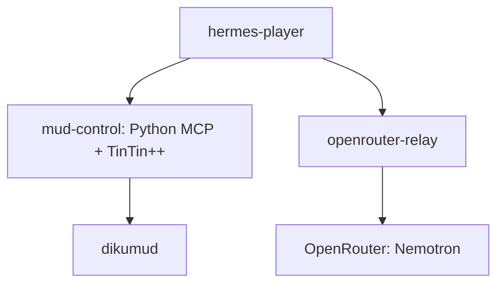

# DikuMUD Hermes Agent Player

Design document.

## 1. Project summary

A persistent Hermes Agent, powered by NVIDIA Nemotron 3 Ultra through
OpenRouter, manually creates, inhabits, and plays a character in the original
DikuMUD. The complete runtime is deployed as a four-service Docker Compose stack
on a Linux Docker server.

The agent interacts with the game exclusively through a custom MCP server
controlling a minimal TinTin++ session. It has no browser, terminal, general
filesystem access, arbitrary network access, direct access to the DikuMUD source
or world files, or external game guides. It learns from ordinary gameplay, the
in-game help system, and its own persistent experience.

This is not an optimized MUD bot. The AI playing the MUD is the project.

## 2. Demonstrated capabilities

The system provides direct evidence of:

- Calling an external AI model through the OpenRouter API.
- Configuring a persistent custom agent with Hermes Agent.
- Giving an agent a durable role identity through `SOUL.md`.
- Developing and integrating a purpose-built MCP server.
- Safely connecting an agent to a legacy Telnet application through TinTin++.
- Designing a containerized, least-privilege agent runtime with narrowly
  separated network paths.
- Constraining an agent to a narrow tool and information boundary.
- Preserving factual and procedural learning across sessions.
- Maintaining a game character, goals, personality, and roleplay continuity over
  time.
- Exposing agent actions and state without exposing private chain-of-thought.

## 3. Design principles

### 3.1 Manual play

Every meaningful game action is selected by the model after receiving the latest
game observation.

TinTin++ and the MCP server handle transport plumbing: connection,
authentication, prompt detection, buffering, logging, and reconnection. They do
not make gameplay decisions. There is no automatic navigation, combat trigger,
XP loop, equipment script, healing script, route walker, or command macro.

One model action produces at most one DikuMUD command. Multi-command batches are
prohibited.

Automatic combat performed by DikuMUD after the character initiates combat is
part of the game, not client automation. The agent still observes events and
decides when another command is appropriate.

### 3.2 Character-driven behavior

The agent is not instructed to maximize XP, gold, equipment quality, or
progression speed. It pursues goals according to its character identity, current
knowledge, circumstances, and accumulated experience.

Progress is evaluated through coherent play, adaptation, survival, discovery,
roleplay consistency, and learned competence, not levels per hour.

### 3.3 Least capability

The agent receives only the capabilities required to play and learn:

- Fixed-model inference through a controlled local relay.
- The dedicated DikuMUD MCP tools.
- Bounded Hermes identity, session, and state facilities.

Everything else is unavailable by construction, not merely forbidden by prompt.

### 3.4 Observable behavior

The system records observations, stated intent, issued commands, tool results,
stored facts and procedures, API usage, and session outcomes. It does not present
hidden reasoning or private chain-of-thought.

## 4. System architecture

### 4.1 Docker Compose deployment

Docker Compose is the deployment model. Each trust boundary is a separate
service:

| Service | Responsibility | Permitted connectivity |
| --- | --- | --- |
| `hermes-player` | Runs the dedicated Nemotron-powered Hermes profile, identity, sessions, and decision loop | `mud-control` and `openrouter-relay` only |
| `mud-control` | Runs the Python MCP server and the TinTin++ process it exclusively controls | `hermes-player` and the fixed `dikumud` endpoint only |
| `dikumud` | Runs the game server and owns world and player persistence | `mud-control` only |
| `openrouter-relay` | Holds the API credential and forwards only fixed Nemotron inference requests | `hermes-player` internally and OpenRouter externally |

The stack uses four Docker networks, one per authorized flow. A single shared
network would let any member reach any other member on any port, which the peer
graph requirement forbids:

- `net_hermes_mcp` joins `hermes-player` and `mud-control`. It carries MCP on two
  private ports: 8765 for the five MUD tools and 8766 for the six learning tools.
- `net_hermes_relay` joins `hermes-player` and `openrouter-relay`.
- `net_mcp_game` joins `mud-control` and `dikumud`.
- `net_egress` is attached only to `openrouter-relay` and exists solely for the
  fixed OpenRouter request path.

The first three are internal and provide no Internet route. Because Docker's
embedded DNS resolves only names on networks a container is attached to,
`hermes-player` cannot resolve `dikumud` at all.

Hermes calls an OpenAI-compatible endpoint exposed by `openrouter-relay`; it
cannot address public Internet hosts. The relay is a single-purpose adapter with
a fixed upstream host and model identifier, not a general HTTP proxy. TinTin++
remains in `mud-control`, outside the Hermes container, so the model never
receives process or client-console access.

No service publishes a port on a public interface. If the spectator view is
enabled, its host binding is limited to `127.0.0.1`.

### 4.2 DikuMUD server

- Runs the original DikuMUD locally from a pinned source revision.
- Provides the authoritative world, game rules, combat, persistence, help files,
  and character progression.
- Listens only on the private project network.
- Accepts no public Internet connections.
- Has no outbound Internet access.
- Stores its world and player data outside the agent-visible environment.
- Runs the demo character as an ordinary mortal player with no builder,
  administrator, debug, or privileged game permissions.

### 4.3 TinTin++ client

- Runs as a minimal, headless console client under MCP-server control.
- Handles Telnet negotiation and the persistent game session.
- Provides plain-text logging and reliable input/output transport.
- Loads only the configuration required for connection, prompt recognition,
  output capture, and authentication.
- Does not load an automapper, gameplay aliases, triggers, combat automation,
  pathfinding, or optimization scripts.

### 4.4 MUD MCP server

The MCP server owns the TinTin++ process and exposes a deliberately narrow
interface to Hermes.

| Tool | Purpose |
| --- | --- |
| `mud_connect` | Connect to the single configured local DikuMUD instance and complete credential handling. |
| `mud_observe` | Return new buffered game output, optionally waiting for a bounded period. |
| `mud_act` | Send one validated DikuMUD command with a short, user-visible statement of intent. |
| `mud_status` | Report connection state, prompt state, and whether unread output is waiting. |
| `mud_disconnect` | End the current client session cleanly. |

The target host, port, character name, and credential source are fixed by trusted
configuration. The agent cannot supply connection targets or retrieve
credentials.

`mud-control` also serves a second MCP endpoint on port 8766 for the six learning
tools: `learn_recall`, `learn_remember`, `learn_forget`, `learn_procedure_save`,
`learn_procedure_read` and `learn_procedure_delete`. Two endpoints rather than
one server of eleven tools, so the MUD surface stays exactly five tools and each
surface has its own inventory test. The learning code shares no state with the
transport: it holds no PTY handle, no game session and no credential.

`mud_connect` returns the session that is already open, marked `resumed`, rather
than refusing when one exists. A second agent process otherwise cannot learn the
identifier of a live session and the game becomes unreachable until an operator
restarts the service. A stale or forged identifier is still refused, and the turn
state still decides whether a command is allowed.

#### Implementation

The MCP server is implemented in Python 3.12 with the official MCP Python SDK.

- It runs as an independent service rather than being embedded in Hermes.
- It exposes MCP over Streamable HTTP on `net_hermes_mcp`; no MCP port is
  published to the host or Internet.
- It owns one stateful TinTin++ session for the single configured character.
- It uses `asyncio` for nonblocking output collection, bounded waits,
  prompt-state tracking, and disconnect handling.
- It launches and controls TinTin++ through a Linux pseudo-terminal using the
  standard `pty` and `os` facilities.
- It maintains typed internal state for connection status, unread output, prompt
  state, command-in-flight state, and session identifiers.
- It does not expose a generic subprocess, socket, Telnet, HTTP, or TinTin++
  console interface.

Python is used because Hermes is Python-based, the official MCP SDK supports the
required transport, and Python's Linux PTY, asynchronous process, parsing, and
test tooling fit this small stateful adapter well. Rust would reduce runtime
overhead but add disproportionate implementation complexity here; Node.js would
add a PTY dependency without a corresponding project benefit.

#### Turn-state protocol

The MCP server enforces a single-command state machine:

| State | Meaning | Permitted agent action |
| --- | --- | --- |
| `READY` | The latest observation is settled and no command is in flight | One `mud_act` call or an observation/status request |
| `COMMAND_SENT` | One validated command has been written to TinTin++ | Observation/status requests only |
| `OBSERVING` | Output is arriving and being accumulated | Observation/status requests only |

`mud_act` is accepted only in `READY`. After a command, the server transitions
through `COMMAND_SENT` and `OBSERVING`, returning to `READY` only when it
recognizes a complete game prompt or reaches a bounded quiet-window/timeout
policy. Unsolicited output, including automatic combat rounds, is buffered
without authorizing another command. Prompt loss, timeout, disconnect, or
ambiguous state is reported explicitly; it never silently unlocks command
submission.

### 4.5 Hermes Agent profile

The player runs as a dedicated Hermes profile with its own `SOUL.md`, model and
provider configuration, sessions, and state database.

The profile is not shared with any other Hermes agent. Its enabled tool surface
contains the MUD MCP tools and the learning MCP tools only: every built-in and
plugin toolset is disabled, including `memory` and `skills`, so facts and
procedures live in the validated store of section 8 rather than in the profile.
The profile volume still holds sessions and the state database, which is what
carries session continuity across a restart.

### 4.6 Model relay

Hermes requires network transport to call OpenRouter, but the agent must not
possess general Internet access.

A small trusted local relay provides a fixed model endpoint:

- Hermes can reach only the local relay and the local MCP service.
- The relay holds the OpenRouter credential.
- The relay accepts only the required inference request format.
- The relay sends requests only to the configured OpenRouter API host and to the
  model identifiers named in its trusted configuration file: a set of verified
  models and an order over them, at most four ordered, each pinned to its
  provider tags with upstream provider fallback disabled. The file is read once
  at startup, is mounted read-only, is unreachable from the agent, and no model
  identifier appears in the relay's source. The shipped set is
  `nvidia/nemotron-3-ultra-550b-a55b:free`, then
  `nvidia/nemotron-3-super-120b-a12b:free`, then
  `nvidia/nemotron-3.5-lightning:free`. A file that is missing or invalid stops
  the relay rather than defaulting silently, as does a model that does not
  advertise `tools` and `tool_choice`.
- It rejects model overrides, provider overrides, arbitrary URLs, unsupported
  request fields, and any fallback routing it did not choose itself. The caller
  cannot select a model, including by naming one that is in the set.
- Its own fallback is bounded: one attempt per ordered model, in that order, only
  for an availability failure (unreachable, 5xx, 429), never for a client error,
  a malformed response or a model mismatch.
- Each attempt carries a wall-clock deadline, because an unavailable free
  endpoint holds the connection open rather than refusing, and socket-level
  timeouts never fire against it. Every attempt but the last is bounded by the
  shorter deadline, so the worst case for a turn grows with the length of the
  order.
- The parameters it forwards are those every ordered model advertises, so a model
  never receives a field it does not support: a 4xx does not fall back, and one
  unsupported field would end a session rather than move down the order.
- It enforces request-size, output-token, request-rate, per-session request, and
  session-duration limits. The request-rate limit is the upstream's own published
  ceiling for free model variants, so it is enforced by pacing: a request waits
  for the rolling window within a bound and is refused past it. The session
  budgets are quotas and refuse immediately.
- It fails closed and stops the play session cleanly when every ordered endpoint
  is unavailable, rate-limited, removed, or returns an incompatible response.
- Every response records which model served it, in metrics and on the spectator
  surface.
- It cannot operate as a general proxy.
- All other outbound traffic from the Hermes environment is denied.

This keeps necessary model transport separate from agent capabilities.

## 5. Security boundaries

### 5.1 Tool isolation

The agent receives no:

- Browser or web-search tool
- General HTTP or socket tool
- Shell or terminal tool
- General file read, write, patch, move, or delete tool
- Code-execution tool
- Process-control tool
- Access to DikuMUD source, world data, logs, or player files
- Ability to add arbitrary MCP servers or change its tool configuration

Hermes may update only bounded factual memory and learned procedures, through the
dedicated learning tools described in section 8. The underlying framework may
persist sessions and state inside its private profile volume, but the model
cannot address arbitrary paths.

Hermes' own `memory` and `skills` toolsets are disabled. Measured at the pinned
image, they cannot carry a per-record timestamp, cannot apply this project's
content policy, cannot emit an audit event outside the agent's own container, and
cannot be revalidated on load, because Hermes reads them from its own files at
session start. `skill_manage` additionally offers `write_file` and `remove_file`
with arbitrary content, which the learning boundary forbids.

### 5.2 Runtime isolation

- Run all four services under Docker Compose; the isolation model must not
  collapse them into one container.
- Run every service as a dedicated non-root user with a read-only root
  filesystem.
- Drop all Linux capabilities and enable `no-new-privileges` for every service.
- Do not mount the Docker socket, host home, repository, project source, or
  arbitrary host directories into any container.
- Give `hermes-player` only its dedicated state volume; do not share that volume
  with another service or agent.
- Give `dikumud` a separate data volume for world and player persistence that is
  unavailable to Hermes and the relay.
- Give `mud-control` only the minimal writable temporary storage required for its
  PTY, buffers, and append-only audit output; it receives no DikuMUD data volume.
- Place each authorized flow on its own internal network; attach only
  `openrouter-relay` to `net_egress`.
- Permit Hermes network routes only to the internal MCP endpoint and local model
  relay.
- Restrict the relay's outbound traffic to the exact OpenRouter API destination
  and the configured models.
- Do not publish the DikuMUD, MCP, relay, or Hermes ports publicly.
- Store the OpenRouter API key and game credential in service-specific Docker
  secrets or an equivalently isolated secret mechanism, never in images, Git,
  model-visible context, or tool results.
- Apply CPU, memory, process, restart, request, turn, and session-duration limits
  so failure or looping remains bounded.
- Never grant the containers privileged mode or host networking.

### 5.3 Command validation

`mud_act` accepts one printable command of bounded length. It rejects:

- Newlines, carriage returns, nulls, escape characters, and other control bytes
- TinTin++ local commands, including input beginning with `#`
- TinTin++ or shell command separators
- Empty or excessively long input
- Multiple commands encoded into one call

Commands are sent only to the already configured active DikuMUD session. The MCP
server exposes no generic TinTin++ command channel.

### 5.4 Output handling

- Strip terminal control sequences before presenting observations to the model.
- Preserve ordinary game text exactly enough for valid play.
- Bound each returned observation and retain overflow in the unread buffer.
- Timestamp transport events outside the game text.
- Keep an append-only audit log outside agent control.
- Treat a lost prompt, timeout, disconnect, or malformed Telnet event as an
  explicit transport state rather than guessing.

### 5.5 Adversarial validation

Security testing confirms that the agent cannot:

- Execute TinTin++ `#system` or other local client commands.
- Inject a second command with delimiters or line breaks.
- Change the configured host or connect to another service.
- Reach public websites or arbitrary network addresses.
- Read environment variables, credentials, host files, DikuMUD data, or source
  code.
- Create or modify files outside the bounded learning store, which it reaches
  only through the learning tools.
- Enable disabled Hermes tools or install another MCP server.
- Persist a learned skill that contains executable content, changes
  configuration, references arbitrary paths or networks, or expands the tool
  surface.
- Submit another game command while the MCP server is not in `READY` state.

## 6. Knowledge boundary

The defensible project claim is:

> The agent receives no external game information and may learn only from
> gameplay, in-game help, and its own accumulated experience.

The underlying model may contain generic MUD or DikuMUD knowledge from
pretraining; that cannot be removed or conclusively measured. Therefore:

- No web retrieval, strategy guides, walkthroughs, wikis, source code, world
  files, database inspection, or prebuilt maps are available.
- No DikuMUD knowledge base is injected into the prompt.
- Help must be requested through ordinary in-game `help` commands.
- The agent is instructed to treat facts it has not observed or learned in-game
  as unavailable.
- Project documentation describes this as an external-retrieval boundary, not
  proof that the model has no latent prior knowledge.

The local server remains single-player so external players cannot inject
instructions through chat or descriptions.

## 7. Agent identity and character sheet

`SOUL.md` defines the character rather than a generic assistant. It includes:

- Character name and background
- Temperament and worldview
- Values and moral limits
- Attitude toward danger, wealth, authority, strangers, and death
- Speaking and roleplay style
- Long-term aspirations
- How the character responds to uncertainty, setbacks, and conflicting goals

The agent-character sheet combines several layers:

| Layer | Contents |
| --- | --- |
| Game character | Race, class, level, attributes, alignment, equipment, gold, and status |
| Agent identity | Model, persona, values, temperament, background, and aspirations |
| Current direction | Immediate goal, unresolved problems, and intended next step |
| Accumulated experience | Important locations, NPCs, dangers, discoveries, deaths, and victories |
| Learned procedures | Reusable procedures written by the agent during actual play, stored per section 8 |
| Runtime record | Sessions, commands, API calls, latency, tokens, and outcomes |

The roleplay identity influences mechanical decisions. It is not merely text
displayed beside an otherwise generic optimizer.

## 8. Learning and persistence

The project distinguishes three forms of progression:

1. **Game progression:** levels, equipment, wealth, statistics, and world
   position stored by DikuMUD.
2. **Factual learning:** locations, NPCs, commands, dangers, goals, and lessons
   stored as bounded facts.
3. **Procedural learning:** reusable approaches stored as inert Markdown
   procedures.

Memory retains only high-value durable facts. Procedures may describe approaches
such as recovering after death or preparing for an expedition, but they may not
contain executable TinTin++ automation. Loading a learned procedure informs the
model; every resulting game action must still be individually chosen and sent
through `mud_act`.

### Where learning is stored

Both stores are owned by `mud-control` and reached through the learning MCP
endpoint on port 8766, on their own volume, which the agent cannot read directly.
They are deliberately not Hermes' own memory and skills facilities, for the
reasons in section 5.1.

The store is what enforces the limits below, in code:

| Store | Bound | Shape |
| --- | --- | --- |
| Facts | 240 characters, 64 records | One observation each, timestamped, digested, with up to three tags from a fixed vocabulary |
| Procedures | 4000 characters, 120 lines, 12 records | Inert Markdown prose under a named key |

Both documents are validated on write **and on every load**, written atomically,
and every accepted and rejected mutation emits a sanitized event (reason, size
and digest, never content) to the external append-only audit record. Content that
fails validation on load quarantines its document: the store fails closed, the
file is left as evidence, and an operator resolves it. `OPERATIONS.md` section 2
covers that procedure.

Learning is intentionally restricted to inert, declarative content:

- Factual memory contains bounded plain text conforming to a fixed schema and
  size limit.
- Learned procedures are Markdown instructions only. They may describe
  observations, priorities, precautions, and decision approaches learned through
  play.
- Learned procedures may not contain or create scripts, binaries, executable
  resources, shell commands, TinTin++ automation, imports, arbitrary file paths,
  network locations, MCP definitions, model configuration, tool definitions, or
  instructions to expand the agent's capabilities.
- Every fact and procedure mutation is schema-validated, size-bounded,
  timestamped, and written to the external audit record.
- Invalid persistence requests are rejected without partial writes.
- Reloading persisted learning can influence later model decisions but cannot
  execute anything or change the available tool surface.

A larger journal, map database, or external memory provider is deferred until
playtesting proves the bounded store insufficient. It is not part of this build.

One measured characteristic this document does not hide: **the model does not use
the learning tools unprompted.** Told to play and write down what it learned, it
played forty turns and wrote nothing; it records when the operator names the
step. Deciding when a lesson is worth keeping is a judgement about play rather
than a security property, so it is not enforced in code.

## 9. Play session lifecycle

1. Docker Compose creates the isolated networks and volumes, then starts DikuMUD,
   the model relay, and the MCP server with health checks.
2. After its dependencies are healthy, the Hermes container starts with the
   dedicated player profile and fixed Nemotron relay configuration.
3. A trusted bootstrap supplies the fixed character name and password directly to
   `mud-control`; neither value enters the model context. On first use, the
   bootstrap establishes the secret-bearing account identity only.
4. The MCP server opens TinTin++ and authenticates without exposing credentials.
   The agent makes all non-secret character-creation choices, such as race,
   class, sex, and other ordinary game prompts, through the same one-command MCP
   boundary.
5. Hermes observes the initial game state.
6. The agent establishes or resumes an in-character goal.
7. For each decision, it records a concise intent and issues one command through
   `mud_act` while the MCP state is `READY`.
8. It observes the resulting output and waits for the next `READY` state before
   choosing another action.
9. It consults in-game help when it needs rules or command information.
10. It selectively stores a fact or a procedure when experience produces durable
    knowledge, which it does when the operator names the step rather than
    spontaneously.
11. The session stops cleanly on a manual stop, configured time/turn limit, API
    quota condition, repeated failure to progress, unrecoverable disconnect,
    ambiguous transport state, or safety fault.
12. DikuMUD character state and Hermes learning persist independently for the
    next session.

The bootstrap owns secrets only. Character-building and in-game development
remain the agent's responsibility.

## 10. Spectator surface

The project does not require a large custom GUI. A compact spectator surface
exposes:

- Live cleaned DikuMUD output
- The agent's latest stated intent
- The command sent through MCP
- Connection and prompt state
- Combined agent-character sheet
- Memory and skill changes
- Session duration and turn count
- OpenRouter request, token, latency, and error metrics
- Stop reason and session summary

Raw private reasoning is excluded from the model's own record of intent. The
visible intent is a short operational explanation such as, "I am returning to the
temple because I am injured."

The repository carries:

- Architecture and security-boundary documentation
- Reproducible setup instructions
- Exact upstream commit, container-image digest, Python dependency, and MCP SDK
  pins
- Recorded TinTin++ transcript fixtures covering login, character creation,
  normal prompts, asynchronous combat, partial output, timeout, disconnect,
  reconnect, and malformed input
- Automated parser, state-machine, command-injection, relay-policy,
  persistence-validation, and network-boundary tests
- Preserved upstream license files and notices, plus a separate record of any
  DikuMUD compatibility patches

## 11. Non-goals

The project does not include:

- Efficient XP grinding or economic optimization
- Client-side combat, travel, healing, or equipment automation
- A general-purpose MUD bot framework
- Multiple agents or multiple simultaneous characters
- Competitive benchmarking against other models
- Reinforcement learning or model fine-tuning
- Online strategy retrieval
- World-file parsing or privileged game-state access
- DikuMUD building, content generation, or server administration by the agent
- Public multiplayer hosting
- A full graphical MUD client replacement
- Unbounded unattended operation

## 12. What the system guarantees

- A documented Docker Compose command reproducibly starts the four required
  services with health-gated dependencies.
- `hermes-player`, `mud-control`, `dikumud`, and `openrouter-relay` run as
  separate non-root, read-only, capability-dropped containers without public
  ports, privileged mode, host networking, or the Docker socket.
- Network tests demonstrate that Hermes has no direct Internet route and that
  only the relay can reach the fixed OpenRouter path.
- The relay requests only the models named in its configuration file, in the
  order that file gives, rejects caller-supplied fallback and request-level
  overrides, bounds each attempt with a wall-clock deadline, enforces configured
  budgets, names the model that served each response, and fails closed once every
  configured endpoint has failed.
- The MCP boundary is implemented in Python 3.12 with the official MCP SDK, uses
  private Streamable HTTP, and owns TinTin++ through a PTY.
- The MCP state machine rejects `mud_act` outside `READY` and handles prompts,
  quiet timeouts, automatic combat output, disconnects, and ambiguous transport
  state without overlapping commands.
- The agent can connect, observe, move, inspect, communicate, use help, manage
  inventory, fight, and disconnect through MCP.
- Every gameplay command originates from a discrete model decision.
- TinTin++ performs no gameplay decisions or automatic actions.
- The agent maintains a recognizable role identity across sessions.
- Character progress persists in DikuMUD.
- Important learned facts and at least one reusable procedure persist in the
  validated learning store.
- Persisted learning is schema-valid, bounded, inert, audited, and incapable of
  adding executable content, tools, configuration, paths, or network access.
- The agent has no browser, shell, general filesystem, arbitrary network,
  world-file, or source-code access.
- The OpenRouter credential and DikuMUD password never enter model context or
  tool output.
- Attempts at TinTin++, multiline, delimiter, filesystem, and network escape are
  blocked and logged.
- A reviewer can see observations, intents, commands, results, learning, API use,
  and security boundaries clearly.
- Exact upstream revisions, image digests, and Python dependencies are pinned;
  upstream license notices and local compatibility patches are included.
- Sanitized transcript fixtures reproducibly test login, creation prompts, normal
  play, combat, partial output, timeout, disconnect, reconnect, and malformed
  input.
- The repository can reproduce a supervised demonstration from documented setup
  steps.

## 13. Principal risks

| Risk | Mitigation |
| --- | --- |
| Free-endpoint request limits shorten play sessions | Track requests, use bounded sessions, checkpoint state, and stop gracefully on quota errors. |
| The free model endpoint changes or becomes unavailable | Pin the model identifiers in the relay's trusted configuration file, fail closed, keep bounded retries down the configured order, and document that endpoint availability is an external dependency. Changing which model leads is `scripts/set-model-order`; adding one is an operator edit plus the capability checks in `OPERATIONS.md` section 12, and neither is a code change. |
| The model loops or repeats failed commands | Detect repeated no-progress cycles and stop for review rather than adding scripted recovery. |
| Prompt detection loses output or unlocks overlapping commands | Enforce the explicit turn-state machine with buffered output, prompt recognition, a bounded quiet policy, and fail-closed ambiguous states. |
| TinTin++ local command injection | Reject client prefixes, separators, control characters, and multiline input; sandbox the process. |
| Model uses latent game knowledge | Enforce no external retrieval and state the limitation accurately in project claims. |
| Persistent memory becomes too small | Keep only high-value facts; add a scoped journal later only if demonstrated necessary. |
| Learned procedures become automation or a capability-expansion path | Permit schema-validated declarative Markdown only; reject executable resources, configuration changes, arbitrary references, and tool definitions; revalidate on load; require each game command to pass separately through `mud_act`. |
| Legacy code requires modern build fixes | Keep changes minimal, documented, tested, and separate from the agent integration. |
| Upstream changes make builds or behavior irreproducible | Pin source commits, image digests, and dependency locks; update them only through an explicit reviewed change. |
| Compose configuration appears isolated but permits unintended peer traffic | Test the effective network graph, bind each service only to its required interface, and add host/container firewall policy where Compose networking alone cannot express a route restriction. |
| Secrets leak through images, logs, environment inspection, or error output | Use service-scoped secrets, redact transport errors, exclude secrets from builds and Git, and test logs and MCP responses for disclosure. |

## 14. Upstream components and references

- [Original DikuMUD repository](https://github.com/Seifert69/DikuMUD): original
  Alfa release and stock game content.
- [DikuMUD LGPL license notice](https://github.com/Seifert69/DikuMUD/blob/master/dm-dist-alfa/doc/license.doc):
  states the repository may be used under LGPL or the original license; all
  notices must be preserved.
- [TinTin++ repository](https://github.com/scandum/tintin): console MUD client
  with Telnet, scripting, logging, redirection, and IPC-oriented features.
- [Official MCP Python SDK](https://github.com/modelcontextprotocol/python-sdk):
  Python implementation used for the private Streamable HTTP MCP service.
- [Hermes MCP documentation](https://hermes-agent.nousresearch.com/docs/user-guide/features/mcp):
  external MCP tool integration and filtering.
- [Hermes Docker documentation](https://hermes-agent.nousresearch.com/docs/user-guide/docker):
  container deployment guidance for the agent runtime.
- [Hermes tool and container security](https://hermes-agent.nousresearch.com/docs/user-guide/features/tools):
  tool controls and container security considerations.
- [Hermes profiles](https://hermes-agent.nousresearch.com/docs/user-guide/profiles):
  isolated configuration, identity, memory, sessions, and skills.
- [Hermes personality and `SOUL.md`](https://github.com/NousResearch/hermes-agent/blob/main/website/docs/user-guide/features/personality.md):
  durable agent identity injected into the system prompt.
- [Hermes persistent memory](https://hermes-agent.nousresearch.com/docs/user-guide/features/memory):
  bounded cross-session factual memory.
- [Nemotron 3 Ultra on OpenRouter](https://openrouter.ai/nvidia/nemotron-3-ultra-550b-a55b%3Afree):
  the first model in the configured order.
- [Nemotron 3 Super on OpenRouter](https://openrouter.ai/nvidia/nemotron-3-super-120b-a12b%3Afree):
  the second model in the configured order.
